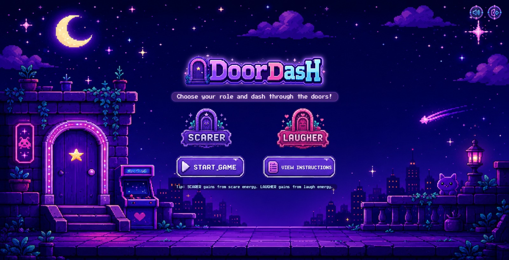
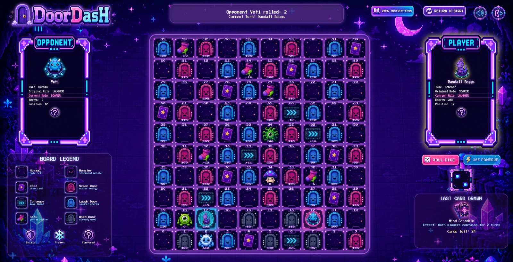
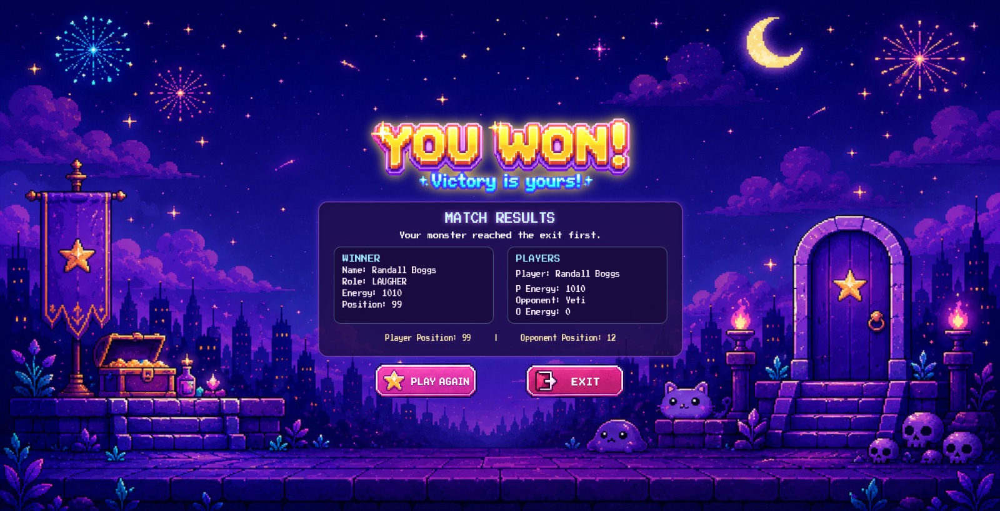

# DoorDasH

A turn-based JavaFX board game developed as a four-person **CSEN401** university project at the German University in Cairo.



## Overview

DoorDasH is a two-player board game in which the player chooses to compete as either a **Scarer** or a **Laugher**. The player and a computer-controlled opponent move across a 10×10 serpentine board, collect energy, draw cards, encounter special cells, use character power-ups, and race to reach the exit with the required energy.

## Features

- Role selection between Scarer and Laugher
- Random character assignment based on the selected role
- Interactive 10×10 serpentine game board
- Dice-based turn system
- Door cells that award scare or laugh energy
- Card cells with multiple card effects
- Conveyor belts, contamination socks, and stationed monsters
- Character-specific power-ups
- Frozen, confused, and shield status effects
- Dynamic player and opponent information panels
- In-game instructions and board legend
- Animated visual feedback and end-game screens
- CSV-based loading for monsters, cards, and cells

## Screenshots

### Game board



### Victory screen



## Technologies

- Java
- JavaFX
- Object-oriented programming
- CSS
- CSV data loading
- Eclipse

## My Contributions

I developed the complete JavaFX interface, excluding the audio functionality. My work included:

- Building the start, gameplay, instructions, and end-game screens
- Rendering and updating the interactive 10×10 board
- Connecting the interface to the game engine
- Implementing player controls, status indicators, card feedback, and game-state updates
- Creating visual transitions, animations, popups, and responsive screen layouts
- Contributing to the engine through the `Board`, `Game`, and `Constants` classes

This project was completed collaboratively by a team of four students.

## Project Structure

```text
src/game/engine/      Core game logic, cards, cells, monsters, and exceptions
src/game/gui/         JavaFX application, views, components, utilities, and assets
cards.csv             Card definitions
cells.csv             Special board-cell definitions
monsters.csv          Monster definitions
screenshots/          Project screenshots used in this README
```

## Running the Project

### Requirements

- Java 8 with JavaFX included, or a newer JDK configured with a compatible JavaFX SDK
- Eclipse IDE is recommended for the current project configuration

### Steps

1. Clone or download the repository.
2. Import it into Eclipse as an existing project.
3. Confirm that JavaFX is configured in the project build path.
4. Keep `cards.csv`, `cells.csv`, and `monsters.csv` in the project root.
5. Run `game.gui.Main`.

## Academic Context

This project was developed for the CSEN401 course at the German University in Cairo and is shared as a portfolio demonstration of the team's software-engineering work.

## Disclaimer

This is a non-commercial educational project. Character names and themed references associated with *Monsters, Inc.* belong to their respective rights holders. Visual and audio assets remain the property of their original creators.
